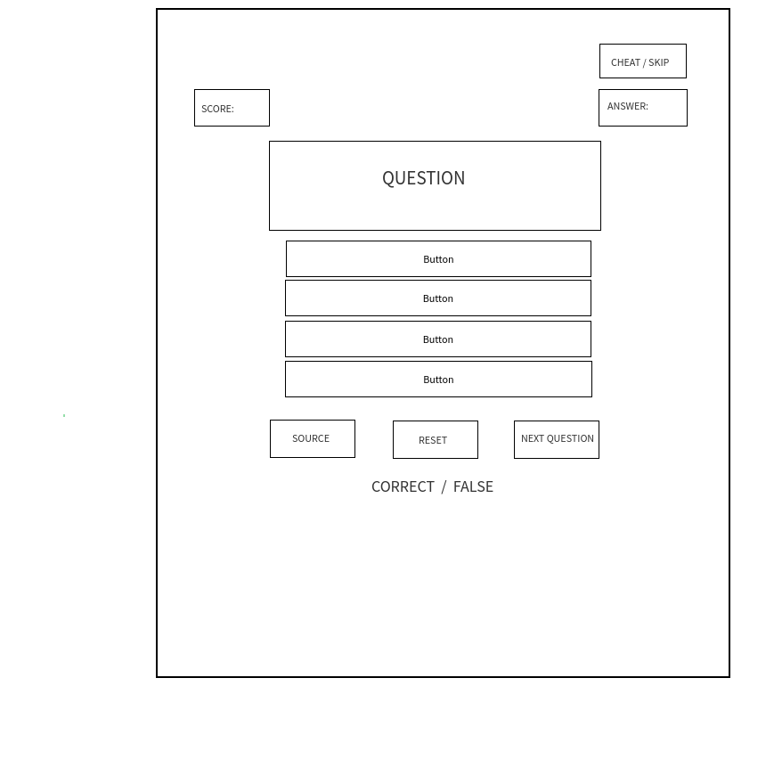

# JavaScript Quiz

This is a simple website in which users can check their JS knowledge by taking a quick quiz.

The purpose of this project is to practice how to decompose & plan projects, organize your code, and use HTML, CSS and JavaScript.

What is new about this project? With this project you should also learn how to use **State**. This is a fancy programming term to talk about the data stored by your web pages. Nearly every app you use has state -> message histories, images, profile details, weather reports, … you name it!

To help you understand and debug your projects you will learn about logging - this is a technique where you store a record of every user interaction, all user input, and each state change. With this technique you will find that it is helpful way to simplify and understand what is happening in your program.

## User Story Dependencies

[Story Dependency Diagram](https://excalidraw.com/#json=5248906938023936,dnJz0Qy9tk5M4ho-RUiqYQ)

---

## WIREFRAME

---

## 0.Setup

- Created a new repository from [this template](https://github.com/HackYourFutureBelgium/state-project-js-quiz)
- Clone the repository
- Write initial, basic README
- Add a wireframe
- Start the development strategy
- Prepare a project board
- Push the changes to GitHub
- Turn on GitHub Pages
- Study (and possibly modify) the backlog

## 1. Initialize Application

**As a user I want to see the home page when I load the site**

> Assigned to Miroslav

### REPO

- This user story is developed on branch `page-structure`.
- This branch is merged to `master` branch after completion.

### Changes in HTML

- Write the initial content for the page
- Write all the buttons needed for the page

### Changes in CSS

- Make starter basic style to the content the page

### Changes in JavaScript

- Write all questions, possible answers, correct answers and links in the "questions" array in the data.js file.

## 2.

**As a user I want to see..**

> Assigned to

### REPO

- This user story is developed on branch `_`.
- This branch is merged to `master` branch after completion.

### Changes in HTML

### Changes in CSS

### Changes in JavaScript

---

## 3.

**As a user I want to see..**

> Assigned to

### REPO

- This user story is developed on branch `_`.
- This branch is merged to `master` branch after completion.

### Changes in HTML

### Changes in CSS

### Changes in JavaScript

---

### 4.

**As a user I want to see..**

> Assigned to

### REPO

- This user story is developed on branch `_`.
- This branch is merged to `master` branch after completion.

### Changes in HTML

### Changes in CSS

### Changes in JavaScript

---

## 5.

**As a user I want to see..**

> Assigned to

### REPO

- This user story is developed on branch `_`.
- This branch is merged to `master` branch after completion.

### Changes in HTML

### Changes in CSS

### Changes in JavaScript

---
